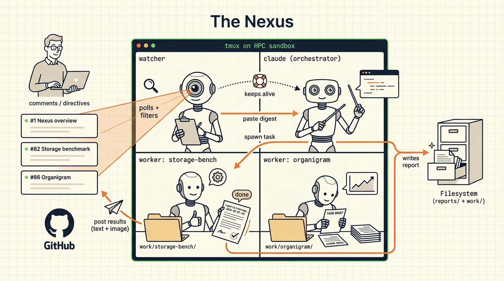

# nexus

**A utility for running multiple Claude Code instances in parallel
and managing them as a team** — spawning new workers for specific
tasks, observing their state through tmux and GitHub, routing
follow-ups, and cleaning up when each one finishes.

📖 **Documentation:** <https://katosh.github.io/nexus/>



Three things nexus is designed to give you:

- **Minimal distraction for workers.** A worker sees its task,
  the safety floor, and a brief project preamble — nothing about
  the broader orchestration. Failures stay contained to a single
  tmux window and don't propagate to siblings.
- **Long, complex, multi-step tasks.** Workers can do research,
  download data, write code, run tests, execute long-running
  analyses, and produce reports, notebooks, plots, or PDFs — over
  hours or days. The orchestrator-watcher loop keeps them on
  track without micromanaging.
- **GitHub as the communications hub.** Workers and the
  orchestrator post on GitHub issues and PRs; the operator reads
  and replies there. No bespoke UI to learn; mobile push
  notifications fire on every state change.

> ⚠️ **Containment required.** Nexus launches each worker as
> `claude --dangerously-skip-permissions`, so workers can run
> shell commands without per-action confirmation. Run nexus
> **only** inside [agent-sandbox](https://github.com/katosh/agent_sandbox)
> (recommended), a VM, or another containment layer that
> constrains what the worker can read, write, and execute. Do
> not run on a development laptop without containment.

> **Documentation:** the full guide is the docs site at
> **<https://katosh.github.io/nexus/>**. This README is a
> signpost; the depth lives there.

## What nexus does

A short tour of the moving parts; click through to the docs for any
one of them.

- **Turns GitHub issues into a control surface.** Comments on a
  pinned overview issue (or any per-thread issue) are surfaced to a
  long-running agent by an in-process bash *watcher*. The agent
  reacts 👀 on intake and 🚀 on completion, so push notifications
  on your phone tell you when work moves. Deep dive:
  [Operating → Dashboard](https://<your-org>.github.io/nexus-code/operating/dashboard/).
- **Spawns one tmux window per task.** An *orchestrator* Claude
  Code session reads each watcher emit, decides whether to handle
  it in-band or delegate, and launches workers as sibling tmux
  windows via `monitor/spawn-worker.sh`. Each worker owns one
  task end-to-end; failures are contained to a single window.
  Deep dive:
  [Operating → Spawning workers](https://<your-org>.github.io/nexus-code/operating/spawning-workers/).
- **Posts as a bot, not as you.** Every GitHub write originates
  from a per-operator GitHub App installed on a private
  asset+issue repo. That separation is what keeps mobile push
  notifications firing — GitHub mutes self-authored notifications.
  Deep dive:
  [Admin → GitHub App](https://<your-org>.github.io/nexus-code/admin/github-app/).
- **Writes structured reports on every hand-off.** Workers end
  with `monitor/ng wrap-up`, which validates a five-section report
  against a schema, uploads it to the asset repo, posts the link
  as a comment on the tracking issue, rockets the trigger
  comment, and tells the orchestrator to clean up the window.
  Reports are the resumption surface after a crash. Deep dive:
  [Operating → Reports](https://<your-org>.github.io/nexus-code/operating/reports/).
- **Distils orchestration patterns into reusable skills.** Files
  under `skills/nexus.*/SKILL.md` carry the safety floor every
  worker inherits (bot identity, no `--no-verify`, no force-push,
  report convention) and the orchestrator's window-cleanup
  policy. Editing one file updates every subsequent worker. Deep
  dive:
  [Reference → Skills](https://<your-org>.github.io/nexus-code/reference/skills/).
- **Recovers itself from common stalls.** The watcher carries an
  auto-unstick library for permission prompts, Anthropic
  rate-limit cascades, and transient API errors. A mutual-liveness
  contract lets the orchestrator and watcher each respawn the
  other; a crash-loop guard breaks runaway respawn cycles. Deep
  dive:
  [Reference → Watcher protocol](https://<your-org>.github.io/nexus-code/reference/watcher-protocol/).
- **Updates itself on `git pull`.** The watcher is version-aware:
  it detects when a pull changed the code any component loaded at
  start and self-restarts (or restarts the affected service) on
  its own — pulling the repo is the entire update story. Deep
  dive:
  [Operating → Upgrading](https://<your-org>.github.io/nexus-code/operating/upgrading/).

Nexus instances are designed for a single operator. Teams that
want to collaborate typically run one nexus per operator —
separate asset+issue repos, sandboxes, and configs — and
coordinate informally through GitHub (cross-bot issues, PRs,
mentions) or through shared write directories on a common
filesystem. There is no tested multi-operator setup, and
cross-operator GitHub activity is advisory: if one operator's
bot opens an issue on another's repo, that nexus does not
auto-action it — the receiving operator reads it and decides
whether to engage. See
[Admin → Repos § Collaboration patterns](https://<your-org>.github.io/nexus-code/admin/repos/#collaboration-patterns).

## Getting started

> 🚫 **This template is not intended for public use.** It ships
> disabled and refuses to start: every start route (`./watcher` /
> `./nexus`, `monitor/svc.sh up`, `monitor/bootstrap-install.sh`)
> exits with a notice.

Nexus has a **one-time setup** (asset repo, GitHub App, config) and
a **per-session run loop** (a single command that launches the
sandboxed tmux session). Setup takes ~15-30 min the first time;
running it afterwards is one command.

### One-time setup

The recommended path is Claude-Code-driven: launch a one-shot
bootstrap session in agent-sandbox and let it walk you through
asset-repo creation, the GitHub App, the webhook, `config/nexus.yml`,
the smoke tests, and the first `./watcher`. You answer three or
four questions and click through a couple of browser pages; Claude
Code does the heavy lifting and stops if anything fails.

1. **Install [agent-sandbox](https://github.com/katosh/agent_sandbox)
   per-user.** `brew tap katosh/tools && brew install agent-sandbox`.
2. **Clone the code repo.** `git clone
   https://github.com/<your-org>/nexus-code.git && cd nexus-code`.
3. **Launch the bootstrap.** From inside the clone:
   ```bash
   agent-sandbox tmux new-session ./monitor/bootstrap-install.sh
   ```
4. **Follow Claude Code's prompts.** It will create your private
   asset+issue repo, walk you through the GitHub App in your
   browser, generate `config/nexus.yml`, run the smoke tests, and
   tell you to launch `./watcher` when done.

The full bootstrap walkthrough plus a fully-manual fallback path
live at
[Getting started → Install](https://<your-org>.github.io/nexus-code/getting-started/install/).

### Run loop

Once configured, the entire daily operation is one command from the
nexus root:

```bash
agent-sandbox tmux new-session ./watcher
```

The launcher self-checks that it's inside tmux + agent-sandbox,
then brings up the whole stack the same way recovery does
(`monitor/svc.sh up`): the watcher starts as a **headless service**
(setsid-detached, log at `monitor/.state/watcher.log`) alongside any
services registered in `monitor/services.registry`, and the watcher
itself spawns the orchestrator window within a few probe cycles. The
invoking window becomes the live **service cockpit** (window name
`services`) — the read-only dashboard showing watcher, orchestrator,
and registry services with single-key log tails. `./nexus` is an
equivalent alias for `./watcher`.

Append `--continue` (`agent-sandbox tmux new-session ./watcher
--continue`) to resume the prior orchestrator conversation: the
watcher resumes the exact session named by the session-id pin
(`monitor/.state/orchestrator-session-id`) via `claude --resume`.
Without a valid pin it starts fresh — it never resumes an arbitrary
most-recent session. Without the flag, every cold start is a fresh
orchestrator. Spawned workers always run as fresh sessions —
`--continue` applies only to the cold-start orchestrator path.
Re-running while the stack is already alive is safe; bring-up is
idempotent and you just land in the cockpit.

Day to day, `monitor/svc.sh status|up|logs <name>` is the scriptable
surface for the same stack the cockpit shows.

Once it's up, you drive nexus from GitHub — see
[Operating → Overview](https://<your-org>.github.io/nexus-code/operating/overview/).

## Repo structure

| Top level | Purpose |
|---|---|
| `monitor/` | The watcher loop, the `ng` bot CLI, the orchestrator launch prompt |
| `skills/` | Behavioural skills auto-discovered by worker agents |
| `config/` | Per-operator config template (`nexus.example.yml` → `nexus.yml`) |
| `docs/` | The docs site source (published to `gh-pages` by `.github/workflows/docs.yml`) |
| `CLAUDE.md` | Workspace-wide agent operating protocol — read this if you're trying to understand how a worker decides what to do |
| `watcher` | Symlink → `monitor/watcher/entry.sh` (workspace entry point; `nexus` is an equivalent alias) |
| `work/` | Project checkouts (gitignored; each subdir its own repo) |
| `reports/` | Agent session reports (gitignored; append-only) |

`work/` and `reports/` are gitignored by design. `reports/` carries
a self-ignore pattern so the directory exists after clone but its
contents stay local; a CI workflow rejects any PR that leaks a file
under `reports/`.

## Where to next

The docs site is the source of truth. Useful entry points:

- **[Getting started](https://<your-org>.github.io/nexus-code/getting-started/overview/)**
  — what nexus is, who it's for, prerequisites, install, the first
  session, the vocabulary.
- **[Operating](https://<your-org>.github.io/nexus-code/operating/overview/)**
  — day-to-day playbook: dashboard, workers, watcher, notifications,
  reports, troubleshooting.
- **[Admin](https://<your-org>.github.io/nexus-code/admin/github-app/)**
  — GitHub App creation, repo topology, security model, runtime
  monitoring.
- **[Reference](https://<your-org>.github.io/nexus-code/reference/architecture/)**
  — architecture, every config key, every `ng` verb, the watcher
  protocol, the skills catalog, the file layout.
- **[Contributing](https://<your-org>.github.io/nexus-code/contributing/development/)**
  — local dev, the test suite, adding a skill, release flow.

## Status

Built and used in daily research workflows; hardening toward broader
adoption. The orchestrator/watcher loop, `ng wrap-up`, asset uploads,
the issue control surface, and the skills conventions are
load-bearing and battle-tested. Cross-repo bot writes still require
manual install on each target repo; the deliveries-polling source is
opt-in; the crash-loop guard is conservative. Public surfaces (the
`ng` CLI, `config/nexus.yml` schema, watcher emit shapes) are still
settling and may change between versions until the first tagged
release.

If you're considering adopting nexus, expect to spend time wiring up
the GitHub App and tuning notification channels. The
[GitHub App walkthrough](https://<your-org>.github.io/nexus-code/admin/github-app/)
is the single best predictor of a smooth setup.

## Contributing

PRs welcome. See
[Contributing → Development](https://<your-org>.github.io/nexus-code/contributing/development/)
for branching conventions, local testing, and the bot-identity
rules for cross-repo work. CI blocks any PR that adds files under
`reports/` (those are local-only artefacts uploaded to the asset
repo via `monitor/ng upload`).

For substantive proposals (new skills, new `ng` verbs, watcher
behaviour changes), open an issue first to align on scope.

## Maintainer & lineage

Built and maintained at the
[<your-lab>](https://research.<your-institution>.example/<your-lab>/en.html) at the
<your-institution> to coordinate research code work
across many parallel projects. The lab's specific HPC deployment
notes (the `<login-node>` → `<shared-node-tool>` → shared-HPC-node pattern, the
`<hpc-mount>` filesystem layout, the `<hpc-skills>` add-on) live in
the [<your-lab> addendum](https://<your-org>.github.io/nexus-code/admin/site-addendum/);
nothing in the main guide depends on them.

The architecture is agent-agnostic; the reference orchestrator is
[Claude Code](https://docs.claude.com/en/docs/claude-code/overview).
The kernel-enforced filesystem boundary that makes
`--dangerously-skip-permissions` defensible is
[agent-sandbox](https://github.com/katosh/agent_sandbox); the
optional persistent-JupyterLab companion is
[labsh](https://github.com/katosh/labsh).

## License

MIT — see [`LICENSE`](LICENSE).
