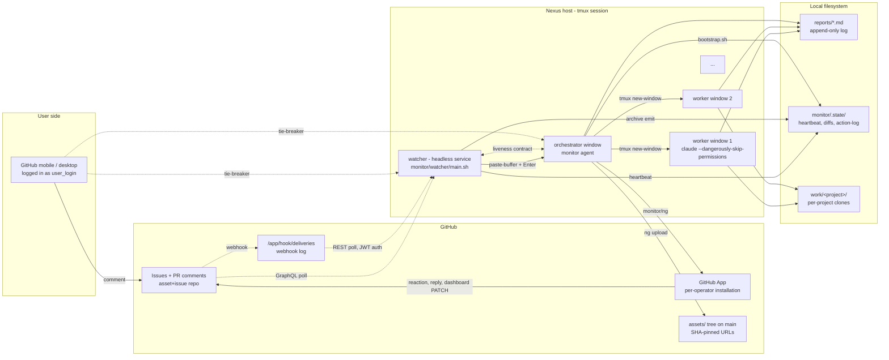
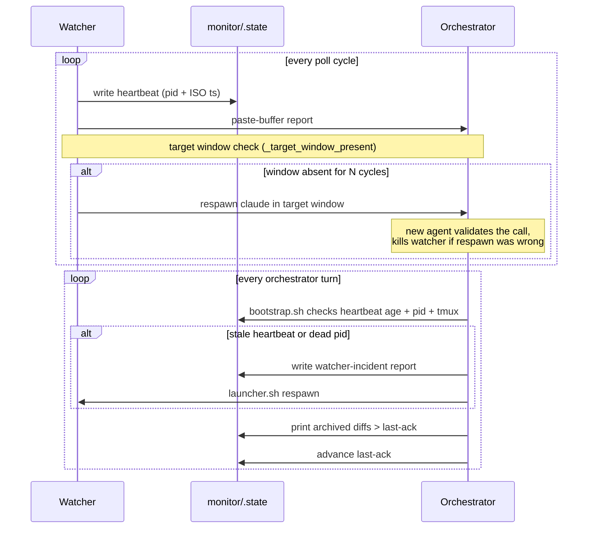

# Architecture

Nexus is a GitHub-Issues control surface for long-running coding
agents running on your own hardware. It turns issue comments into a
two-way command channel: you post from the GitHub mobile app (or
desktop) and an autonomous orchestrator running in tmux reacts,
delegates, and reports back as the bot.

This page is the system in one view. For deeper references see
[Watcher protocol](watcher-protocol.md), [Skills](skills.md),
[Files](files.md), [Config](config.md), [ng CLI](ng-cli.md).

## At a glance

The picture has three jurisdictions:

- **The user side** is a logged-in GitHub session — a phone in your
  pocket, a tab on your laptop. The user posts comments; the bot's
  reactions and replies generate GitHub push notifications. No
  custom client; no app to install on the user side beyond the
  vanilla GitHub mobile app.
- **GitHub** carries the durable state: open issues, PR conversations,
  the bot's installation token, the deliveries log, and the asset
  tree where embedded images and reports live.
- **The nexus host** is a Linux box you own, running a single tmux
  session plus one headless service: the watcher (setsid-detached, no
  window). The tmux windows are the `services` cockpit, one
  orchestrator (the monitor agent), and zero or more workers. State
  that must outlive a session lands on disk under `reports/` (the
  append-only project log) and `monitor/.state/` (runtime
  bookkeeping).

## Components

### Watcher (`monitor/watcher/main.sh`)

A long-running bash loop hosted as a headless service: spawned
setsid-detached by `monitor/watcher/launcher.sh`, liveness-anchored
by its self-published pidfile (`monitor/.state/watcher.pid`), logging
to `monitor/.state/watcher.log`, supervised via `monitor/svc.sh`.
Every `monitor.interval_seconds` (default 60 s) it
samples local state and one or more GitHub surfaces, classifies the
result, and on signal cycles pastes a one-shot report into the
orchestrator's tmux window via `tmux load-buffer` + `paste-buffer` +
`Enter`. The same body is archived to `monitor/.state/diffs/` so
nothing is lost when a paste fails.

The watcher is the only component that polls GitHub on a timer; the
orchestrator and workers are event-driven and turn-based. It also
touches `monitor/.state/watcher-heartbeat` every cycle so the
orchestrator can detect a dead loop without a separate liveness
service. See [Watcher protocol](watcher-protocol.md) for the
snapshot shape, the eligibility filter, the emit classes, the
rate-limit cascade, and the auto-unstick paths.

### Orchestrator — the monitor agent (`orchestrator` tmux window)

A Claude Code session in a dedicated tmux window (default name
`orchestrator`, overridable via `monitor.target_window`). It is
**paste-driven**: a wake is a
report appearing in its pane. The agent's launch behaviour is
specified in `monitor/agent-prompt.md`; the workspace `CLAUDE.md`
adds the cross-cutting rules every agent honours.

The orchestrator's job is to **coordinate, not to do**. Each wake it
runs `monitor/watcher/bootstrap.sh` to ingest missed diffs since
last-ack, processes the new emit (eligible comments, local changes,
standing bells, idle-worker transitions), and either replies in
place or spawns a dedicated worker. Work that produces an artifact
— code edits, scripts, data analysis, image generation — always runs
in a worker window. See [`skills/nexus.tmux-spawn`](skills.md#nexustmux-spawn)
and the "delegate, don't do work" section in `monitor/README.md`.

### Workers (per-task tmux windows)

Each delegated task gets its own tmux window with its own Claude Code
session. The orchestrator creates the window via
`monitor/spawn-worker.sh` (prompt-file + launcher pattern), and the
worker reads its prompt, performs the work, writes a report under
`reports/`, and ends with `monitor/ng wrap-up` to upload the report,
post a templated link comment on the tracking issue, and rocket the
trigger.

Workers act on their assigned scope and never run another delegation
of their own. A worker that finds it needs subwork escalates back to
the orchestrator with a brief, rather than spawning siblings.

### Services cockpit (`services` tmux window)

The first window of the session (default name `services`,
`monitor.services_window`) is the operator's cockpit, managed by
`monitor/svc.sh`. It is not an agent — it is a status surface plus the
control point for the long-running services nexus supervises (the
watcher and any entries in `services.registry`, e.g. a JupyterLab
server). `svc.sh status` renders the live service table; `svc.sh up`
brings the session to its declared state; `svc.sh start|stop|restart
<svc>` and `svc.sh logs <svc>` drive individual services; `n`/`p`
page the cockpit when more services than fit are registered. Because
the watcher runs headless (setsid-detached, no window of its own), the
cockpit is where an operator sees and restarts it. See
[Operating → Dashboard](../operating/dashboard.md) and
[Operating → Upgrading](../operating/upgrading.md).

### The bot — a GitHub App

Every GitHub write originates from a per-operator GitHub App, never
from the user's account. GitHub mutes mobile push notifications for
actions taken by the recipient's own account, so a PR or comment
posted as the user silently fails to wake them — defeating the
control surface. The bot has its own login, its own avatar, and a
separate installation per operator.

Two channels reach the App:

- `monitor/ng <verb>` — preferred for the configured nexus repo.
  Mints the installation token internally, hides verbose `gh api`
  output, and folds two-step sequences into single verbs. See
  [ng CLI](ng-cli.md).
- `GH_TOKEN=$(monitor/mint-token.sh) gh <verb>` — escape hatch for
  cross-repo writes or one-offs `ng` doesn't cover.

The only interactions that may still use the user's identity are
`git commit` and `git push`, so commit authorship stays the user's
on the commit graph. The discipline is documented in
[`skills/nexus.bot`](skills.md#nexusbot).

### State on disk

| Path | Lifetime | Purpose |
|---|---|---|
| `reports/*.md` | session + beyond | Append-only log of agent work. The resumption surface if a session crashes. |
| `monitor/.state/` | runtime | Heartbeat, archived emits, action log, processed-comments cache, rate-limit backoff files. |
| `work/<project>/` | per-project | Project checkouts. Each is its own git repo. Never holds a nexus-specific `CLAUDE.md`. |
| `config/nexus.yml` | install | Per-operator config (repo, bot App IDs, notification creds). Gitignored. |

[Files](files.md) enumerates each file and its retention. The
`monitor/ng report-init` / `wrap-up` / `report-check` verbs (see
[ng CLI](ng-cli.md)) and [`skills/nexus.report`](skills.md#nexusreport)
cover the report schema.

## Data flows

### Inbound — user comment to orchestrator

1. User posts a comment on an open issue or PR in the configured
   asset+issue repo.
2. The watcher's next poll cycle picks the comment up through one of
   three surfaces (see [Watcher protocol — event surfaces](watcher-protocol.md#event-surfaces)):
    - **GraphQL search** (`snapshot_github` in `_github.sh`) over open
      issues + PRs + new issues in the configured repo. Cadence-gated;
      authenticated with the bot installation token.
    - **Deliveries log** (`snapshot_deliveries` in `_deliveries.sh`),
      when `monitor.deliveries.asset_enabled` or
      `monitor.deliveries.bot_mention_enabled` is on (both default true).
      Authenticated with the App-level JWT; runs every cycle on a
      separate rate-limit bucket.
    - **Mentions search** (`snapshot_mentions` in `_mentions.sh`),
      when `monitor.mentions_enabled` is on. Surfaces cross-repo
      mentions of the configured user.
3. The watcher's eligibility filter drops the comment unless: author
   matches `github.user_login`; no non-user EYES reaction exists; no
   ROCKET reaction from anyone exists. Bot-authored comments are
   excluded by the author filter, so no body-prefix convention is
   needed.
4. The watcher composes a report — header, optional local diff,
   `--- eligible github comments ---` section, `--- standing bells
   ---`, `--- idle workers ---`, `--- dashboard ---` footer, and a
   unique `--- nexus-emit-sig --- ` trailer — and pastes it into the
   orchestrator's tmux pane.
5. The orchestrator wakes with the paste as an incoming message,
   processes each eligible comment via `monitor/ng process <cid>`
   (which posts the eyes reaction and prints the body), decides the
   action (routed directive into a worker window vs. plain reply),
   and rockets the comment when fully done.

### Outbound — bot to user

1. The orchestrator calls `monitor/ng reply <issue>` or
   `monitor/ng dashboard put`, which mints a bot installation token
   and PATCHes/POSTs through `gh api` over HTTPS.
2. GitHub fires a mobile push to the user — because the action came
   from the bot account, not the user's own, the notification
   surfaces. The bot's `eyes` + `rocket` reactions are visible on
   the comment alongside any reply.

### Worker spawn

1. The orchestrator picks a tracking issue, drafts a prompt file
   under `/tmp/nexus-spawn-*-prompt.md`, and calls
   `monitor/spawn-worker.sh <window-name> <prompt-file>`. The
   launcher's [Worker floor](skills.md#nexusworker-defaults) is
   prepended automatically — bot identity, no `--no-verify`, the
   report + wrap-up contract.
2. `spawn-worker.sh` creates a new tmux window via a generated
   launcher. By default the window's process is the
   `claude --dangerously-skip-permissions` invocation directly (not
   wrapped in an interactive shell), so the window dies when the
   agent exits and the watcher's `_target_window_present` check can
   detect a missing worker without ambiguity. An optional
   `monitor.retain.use_loop_wrapper` mode runs claude through
   `monitor/claude-loop.sh` instead, for workers that should survive
   a session crash and resume.
3. The worker reads its prompt, performs the task, writes a report
   via `monitor/ng report-init <slug>`, and finishes with
   `monitor/ng wrap-up <issue> <report-path> --trigger-comment <id>`.

## Mutual-liveness contract

The watcher and the orchestrator each check the other is alive. The
configured user on GitHub (`github.user_login`) is the external
tie-breaker if they disagree.

- **Agent to watcher.** Every turn the orchestrator runs
  `monitor/watcher/bootstrap.sh`. The shared `_watcher_alive` helper
  in `_lib.sh` returns one of four buckets (fresh / stale /
  very-stale / no heartbeat) using heartbeat age and the recorded
  pid (identity-validated against the self-published
  `monitor/.state/watcher.pid` — the watcher has no tmux window to
  check). On anything but fresh, bootstrap writes an incident report
  under `reports/` and respawns the watcher headless via
  `launcher.sh`.
- **Watcher to agent.** If the orchestrator's target window goes
  missing for `monitor.agent_missing_respawn_delay` confirming polls
  (default 3 — ~8 s of confirmed absence at the 2 s probe cadence),
  the watcher re-verifies the absence (fresh window probe, pane scan
  for a live orchestrator process, liveness-signal check) and only
  then spawns a fresh `claude` session in the target window. The
  recovery prompt invites the new agent to validate the call; if the
  respawn was a false positive, the new agent stands down by removing
  only its own duplicate window — it must never kill the watcher or
  the tmux session.
- **Crash-loop guard.** More than `monitor.respawn_loop_limit`
  respawns inside `monitor.respawn_loop_window_seconds` (defaults 3
  within 120 s) pins the watcher into a quiet state and fires one
  `sandbox-notify` to the operator. The history clears on the next
  successful paste-to-target.

The contract is fully symmetric: either party can declare the other
dead and act, and either action can be overridden by the user
through GitHub.

## The security boundary

One specific GitHub login can drive the bot. The eligibility filter
inside `snapshot_github` is the enforcement point:

- `comment.author.login == github.user_login` — author match,
  account-based.
- No `EYES` reaction by a login other than the user (bot-side EYES
  means "processing"; a non-user EYES outside the bot means "already
  being looked at").
- No `ROCKET` reaction from anyone (bot-side ROCKET means "action
  taken"; a self-ROCKET by the user is the mobile-friendly "skip
  this" opt-out).

Comments from any other GitHub account are silently ignored even if
that account has repo write access. The agent runs inside a
kernel-enforced sandbox; it cannot reach the App's private key, the
deliveries log, or repos outside its installation scope.

For the full threat model — what the bot can and cannot do, the
three authorization tiers (internal / user-public / external public),
how to handle a leaked private key — see
[`docs/admin/security.md`](../admin/security.md).

## Clone isolation and watcher-touching work

The watcher sources its ~20 helper modules (`_lib.sh`, `_github.sh`,
`_unstick.sh`, `_idle_probe.sh`, `_deliveries.sh`, `_mentions.sh`,
`_scheduler.sh`, `_config.sh`, `_emit_filters.sh`, `_emit_dedup.sh`,
`_compose_nudge.sh`, `_orchestrator_liveness.sh`, `_over_limit.sh`,
`_target_absent.sh`, `_service_health.sh`, `_functional_check.sh`,
`_respawn*.sh`, `_version_restart.sh`, `_cc_update.sh`, …)
once at startup. Functions in memory then call functions on disk — a
mismatch in signatures or behaviour between the in-memory and
on-disk copies (introduced by a `git checkout` on the same clone)
silently breaks `snapshot_github`'s eligibility filter without
surfacing any log error. Workers that edit `monitor/watcher/*`
therefore operate on a **separate clone** of the nexus repo (or a
worktree), never on the live tree, and only the orchestrator pulls
the merged change into the main clone — at which point the
version-aware watcher detects the source drift and self-restarts
([Operating → Upgrading](../operating/upgrading.md)); a manual
`svc.sh restart watcher` is only the disabled-feature/bootstrap
fallback.

This is the load-bearing example of the "independent clones for
parallel work" rule. For the full development workflow see
[`contributing/development.md`](../contributing/development.md).

## Two repos, not one

A nexus deployment uses two GitHub repos:

- **Code repo** — `<your-org>/nexus-code` (or a clone of it). Public,
  versioned, shared across operators. `git clone` and `git pull` are
  the propagation mechanism for upstream changes.
- **Asset+issue repo** — per-operator, typically private (e.g.
  `<your-org>/<your-instance>-nexus-assets`). Holds the
  `nexus:overview` issue, all per-thread issues, the dashboard, and
  the `assets/` tree where `ng upload` commits embeds.

The bot is installed on the **asset+issue repo only**, not on the
code repo. State stays per-operator; the code repo never accumulates
operator-specific issues, comments, or assets. See
[`docs/admin/repos.md`](../admin/repos.md) for the two-repo topology
in detail and the migration story.
