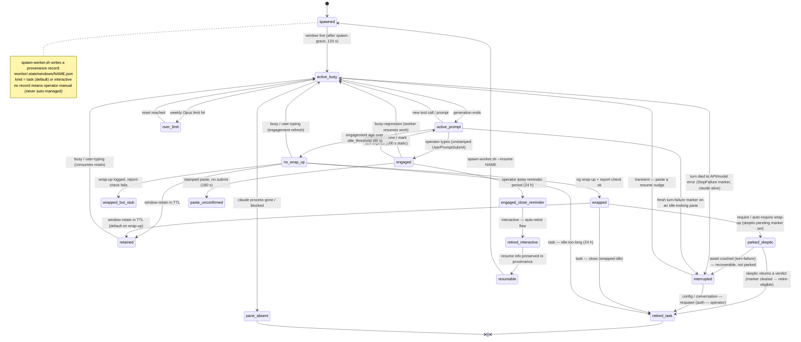

# Worker states

How the watcher knows what a worker is doing. This page is the
vocabulary reference: the pane-level states `monitor/pane-state.sh`
emits, the higher-level classifications `_idle_probe.sh` derives
from them, the engagement-log that anchors idle-age, the
`window-retain` TTL that mutes intentional idleness, and the known
fragility modes operators should recognise.

For the watcher's full emit protocol see
[Watcher protocol](watcher-protocol.md). For the close-decision
policy keyed off these classifications see
[`skills/nexus.window-cleanup`](skills.md) — that skill remains
authoritative for orchestrator behaviour; this page documents the
detections. The **authoritative lifecycle diagram** — every state,
every transition condition with its exact threshold, and the
orchestrator reaction per state — is
[`monitor/docs/agent-state-machine.md`](https://github.com/<your-org>/nexus-code/blob/main/monitor/docs/agent-state-machine.md);
this page stays at the vocabulary level.

## Overview

A worker is a `claude` session in its own tmux window. The watcher
(`monitor/watcher/main.sh`) polls every
`monitor.interval_seconds` (default 60 s) and asks two questions
about each worker window:

1. **What is the pane doing right now?** Answered by
   `monitor/pane-state.sh`, which captures the bottom of the tmux
   pane with ANSI escapes preserved and decides one of eleven
   pane states from the chevron row, spinner row, the over-limit
   notice row, and (refining the `idle` verdict) the worker's
   async-work signals.
2. **Is the worker really idle, and if so, in what way?** Answered
   by `monitor/watcher/_idle_probe.sh`, which combines the pane
   state with an engagement-anchored age, wrap-up event lookup,
   prompt-submit attribution, and `window-retain` TTL check to
   assign a watcher classification.

The two layers separate detection from policy. Pane states are
about the rendered bytes; classifications are about what the
operator (or the orchestrator) should do next.

## Lifecycle state graph

The diagram below orients you to the whole agent lifecycle in one
view: how a worker moves from spawn through active work, idle
classification, retention, and retire — and how the two **window
kinds** (`task` vs `interactive`) diverge at the retire boundary.
It is rendered with Mermaid (`stateDiagram-v2`; the
`pymdownx.superfences` mermaid fence is configured in `mkdocs.yml`,
so it renders inline on GitHub Pages).

This graph stays at the same **vocabulary altitude** as the rest of
this page — it names the states and the headline transition
condition, not every threshold. For the authoritative lifecycle
(every state, every transition condition with its exact threshold,
and the orchestrator reaction per state) see
[`monitor/docs/agent-state-machine.md`](https://github.com/<your-org>/nexus-code/blob/main/monitor/docs/agent-state-machine.md).
The orchestrator's *own* liveness state machine (healthy → grace →
unstick → dead-threshold → respawn) is a separate concern — it
governs the orchestrator process, not workers — and is documented
under [Watcher · Heartbeat and liveness](../operating/watcher.md#heartbeat-and-liveness);
it is **not** duplicated here.



Reading the graph:

- **`spawned` → `active_*`** — every orchestrator spawn writes a
  provenance record (see [Window kind and provenance](#window-kind-and-provenance)
  below). `active_busy` and `active_prompt` are the two live
  working states (the `busy` and `idle` **pane states** in the table
  further down); they never surface a classification.
- **`engaged`** and its neighbours (`busy-regression` back to work,
  `engaged-close-reminder` when the operator goes away,
  `paste-unconfirmed` when a stamped nudge fails to submit) are the
  post-`#270` engagement states. `engaged` corresponds to the
  `operator-engaged` classification; while it holds, idle nags,
  follow-up pastes, and retire-eligibility are all suppressed.
- **`no_wrap_up` / `wrapped` / `wrapped_but_stub` / `retained`** are
  the age-gated **watcher classifications** (table below). A
  `busy`/`user-typing` observation refreshes the engagement-log and
  drops the worker back to active — *consuming* any standing retain.
- **The retire fork is by kind.** A `task` window retires on the
  ordinary `wrapped + idle` (or `idle-too-long`) cycle and is gone.
  An `interactive` window is **not** retire-eligible on that cycle;
  it retires only when the operator has been away a full reminder
  period (`engaged-close-reminder`), via the interactive
  auto-retire flow, and its provenance record keeps it **resumable**
  (`spawn-worker.sh --resume <window>`). The two paths are tabulated
  in [`skills/nexus.window-cleanup`](skills.md) "Interactive-window
  auto-retire lifecycle".
- **`over-limit`, `pane-absent`, `idle-orphan-async`** are
  cross-cutting inviolable detection surfaces — they can interrupt
  from any live state; only the two most common edges are drawn to
  keep the graph legible. `idle-orphan-async` and the two
  non-actionable `idle` refinements (`working-background`,
  `working-self-paced` — "leave it alone") are deliberately *not*
  drawn as nodes: they refine the `idle` verdict rather than mark a
  distinct lifecycle stage. Their full triggers live in the
  pane-states and classifications tables.
- **`interrupted`** is the turn-failure state (`StopFailure` hook):
  the worker's last turn died to an API/model error while the inner
  `claude` stays alive. It is drawn because its recovery genuinely
  forks the lifecycle — `transient` resumes with a paste, while
  `config`/`conversation` need a respawn and `auth` needs the
  operator. Precedence sits above the skeptic park (a crashed `await`
  surfaces here as recoverable) and below `idle-too-long`.
- **`parked_skeptic`** is the skeptic-protocol park
  (`#285`). A worker that wraps up in `require` mode (or an `auto`
  worker that decides `require`) is held by a `skeptic-pending`
  marker: it blocks in `skeptic-channel.sh await`, classifies as
  `parked-awaiting-skeptic`, and is **exempt from idle/close** until
  a skeptic returns a verdict (which clears the marker and makes the
  window retire-eligible). A *stale* marker — the `await` died or the
  worker never entered it — lapses the exemption so a genuine hang
  resurfaces. Full protocol: [`skills/nexus.skeptic`](skills.md) and
  the [Skeptic protocol](https://github.com/<your-org>/nexus-code/blob/main/monitor/README.md#skeptic-protocol)
  monitor surfaces.

### Window kind and provenance

Since `#276`, `monitor/spawn-worker.sh` accepts `--kind
task|interactive` (default `task`) and writes a durable provenance
record to `monitor/.state/windows/<window>.json` on every fresh
spawn:

| Kind | Meaning | Retire trigger | Resume |
|---|---|---|---|
| `task` (default) | Scoped job: pick up work, file a report, wrap up, close. The workspace default; fully backward-compatible. | `wrapped + idle` or `idle-too-long`. | Fresh worker seeded with `-r <prior-report>`. |
| `interactive` | Open-ended operator conversation window (Jupyter exploration, live debugging companion). Listed in the overview's resumable-sessions registry by `ng interactive-sessions`. | `engaged-close-reminder` (operator away ≥ reminder period); the orchestrator runs the interactive auto-retire flow. | `spawn-worker.sh --resume <window>` — provenance preserves the session. |

The **absence** of a provenance record is itself meaningful: it
marks a window as **operator-manual**, and the orchestrator must
not autonomously manage it (no nags, no auto-close). Spawn mechanics
for interactive windows: [`skills/nexus.tmux-spawn`](skills.md)
"Spawning interactive windows"; the close flow and the task-vs-
interactive retire contrast: [`skills/nexus.window-cleanup`](skills.md)
"Interactive-window auto-retire lifecycle".

## Pane states

Output by `monitor/pane-state.sh <window-index>` as a single
key=value line:

```
state=<state> active=<0|1> window=<idx> name=<windowname> [reset_at=<token>] [orphan_kinds=<csv>] [content_hash=<crc>]
```

`reset_at` appears only when `state=over-limit`; it carries the
extracted reset-time token (spaces collapsed to `_`, parens
stripped, capped at 40 chars) from the canonical Claude Code
"You've hit your limit · resets <time>" notice. Value is
`unknown` when the suffix wasn't extractable.

`orphan_kinds` appears only when `state=idle-orphan-async`; it
carries a comma-separated, dedup'd `kind:id,…` list from the
heartbeat's `external_waits` array (e.g.
`orphan_kinds=slurm:52527284_4,ci:<your-org>/runs/26304173692`),
capped at 80 chars with a trailing `…` on overflow, so the
contract violation surfaces with the offending job id.

`content_hash` appears whenever the pane was actually captured —
every renderer-path emit and the heartbeat path's idle-refinement
capture (`idle` / `autosuggest-only` / `user-typing` / `empty` /
`busy`). It is a stable CRC digest of the pane's transcript region
(everything above the `❯<NBSP>` input row) with the most volatile
glyphs — digits, the input row, the status bar — neutralised. The
watcher diffs it across cycles to tell a genuinely-changing pane
from a static one, which gates the self-expiring `operator-engaged`
mark. It is absent on the heartbeat-authoritative `busy` / `blocked`
fast-path emits, where no capture is taken (the probe treats those
agent-working states as implicit change).

The decision walks the visible bottom of the pane (last 25
lines, joined across wraps) and picks the first match in this
order: blocked overlay → over-limit notice → bright user text →
busy spinner → autosuggest dim-cursor → empty input → fallback.

| State | Detection | What it means |
|---|---|---|
| `idle` | Empty input box (`\x1b[7m \x1b[0m`) and no busy spinner. | Claude at the prompt, no input pending. Safe to paste. |
| `busy` | A token-counter spinner (`↓ N tokens` / `↑ N tokens`) on a line within ten rows above the input chevron. | Claude is generating. Don't paste; subsequent input rides the next prompt. |
| `user-typing` | Input row carries the bright-text marker (`\x1b[38;5;231m`). | User has typed actual characters into the input box. Never trample. |
| `autosuggest-only` | Input row matches the dim-cursor pattern (`\x1b[7m.\x1b[0;2m`) with no bright-text prefix. | The grey ghost-text suggestion is showing but the input box is empty. Looks identical to `user-typing` in `tmux capture-pane`'s plain-text output — that's the whole reason this state exists. Operator should ignore. |
| `empty` | No input row matches any positive rule, BUT the pane's process tree still contains a live `claude` process (verified via `tmux #{pane_pid}` + recursive `pgrep`). | Renderer is mid-transition (paste re-render, status-bar swap) while claude is unambiguously alive. Treated by the idle probe as "skip — retry next cycle." NOT a `pane-absent` alarm. (Pre-#72: `empty` mapped straight to `pane-absent`, causing false-positive crash signals on actively busy workers.) |
| `blocked` | Permission overlay (`Do you want to proceed?` + `❯ <digit>.`) or rate-limit menu (`What do you want to do?` + `Stop and wait for limit`) is present. | Claude is waiting on the operator (or the auto-unstick library). |
| `absent` | tmux unreachable, window missing, no `❯<NBSP>` input chevron anywhere in the captured pane AND no live `claude` in the pane's process tree, OR no spinner-fallback match. | The inner Claude REPL is truly gone. (The `busy`-fallback short-circuit in `pane-state.sh` still upgrades to `busy` if a token-counter spinner is visible despite no chevron — see Fragility 1.) |
| `over-limit` | The canonical "You've hit your limit · resets `<time>`" notice and a companion `resets <time>` line both appear within the bottom ~15 rows of the pane. | Claude has hit its weekly Opus limit and is functionally suspended until the reset. The emit line carries a `reset_at=<token>` field so the orchestrator can schedule a resume rather than treat the worker as routinely idle. The bottom-anchor scan rejects transcript scrollback mentions of the same phrase. |
| `working-background` | An `idle` verdict **refined** (issue `#183`) when the worker has an in-flight async tool handle: heartbeat `monitor_handles > 0` / `background_bash_count > 0`, or the pane-footer fallback (`N monitor[s] still running`, `N background bash …`). | The worker looks idle at the prompt but a `Monitor`/background-bash handle is still running inside claude's own process; the harness will wake it on completion. Not idle — leave it alone. |
| `working-self-paced` | An `idle` verdict refined when heartbeat `scheduled_wakeup_at` is in the future. | The worker scheduled a `/loop` `ScheduleWakeup` and the harness will resume it then. Not idle — leave it alone. |
| `idle-orphan-async` | An `idle` verdict refined when heartbeat `external_waits` is non-empty AND neither `working-background` nor `working-self-paced` applies. The emit carries `orphan_kinds=<kind:id,…>`. | The worker declared (or the `PostToolUse` auto-detect spotted) async external work — a Slurm job, CI run, background poller — but installed **no** resume mechanism: a contract violation. `external_waits` has no renderer fallback, so a worker silent about its async work can't be caught here. Surface to the operator; the fix is a wake mechanism or `declare-no-wait.sh`. |

### Detection sources

`pane-state.sh` consults two sources, in priority order:

1. **Worker heartbeat** (primary, since issue `#74`). Each
   nexus-spawned worker's per-spawn Claude Code hooks (declared
   in `skills/nexus.worker-defaults/SKILL.md` under
   `<!-- worker-hooks-default -->`) write
   `monitor/.state/heartbeat/<window>.json` on every tool call,
   notification, and user-prompt submission via
   `monitor/worker-heartbeat.sh`. When `last_activity` is younger
   than `monitor.heartbeat_staleness_seconds` (default 30 s) the
   heartbeat's `state` is authoritative and the pane-byte path is
   skipped. The renderer's false-positive surface (paste
   re-render, spinner mid-cycle, scroll) is bypassed entirely
   when the heartbeat is fresh.
2. **Rendered pane bytes** (fallback). When the heartbeat is
   missing, stale, or malformed (workers without the hooks, e.g.
   externally launched claude sessions), the ANSI-grep path above
   decides the state from the captured pane.

The ANSI-grep substrate is what makes `autosuggest-only`
distinguishable from `user-typing`: the underlying ANSI escape
codes differ even though the rendered glyphs look the same.

Manual sanity-check: when the helper's verdict looks wrong, dump
the same bytes it parses and inspect the input row by eye:

```
tmux capture-pane -t 0:<win> -e -p -S -10 | cat -v
```

`cat -v` renders ESC as `^[`. On the line containing `❯<NBSP>`
(the input row) look for `^[[7m<char>^[[0;2m...` (autosuggest,
ignore) versus `^[[38;5;231m...` (real user input, respect).

## Watcher classifications

`_idle_probe.sh` enumerates every worker window (i.e. every tmux
window other than `watcher`, `claude`, `orchestrator`, `monitor`)
and assigns one class. A window only surfaces in the
watcher's `--- idle workers ---` section when its
engagement-anchored age has crossed
`monitor.idle_threshold_seconds` (default 60 s) AND its pane state
is in the idle/ambiguous/dead set — with one exception:
`over-limit` short-circuits the age gate so a worker hitting the
weekly Opus limit surfaces immediately. Active workers
(`busy` / `user-typing`) never produce a classification row.

| Class | Trigger | Watcher line | Inviolability |
|---|---|---|---|
| `wrapped` | `wrap-up` action-log entry matches this window AND `ng report-check` passes on the cited report. | `<window> wrapped up (idle <age>; wrap-up logged)` | Suppressible by `window-retain`. |
| `wrapped-but-stub` | `wrap-up` entry exists but `ng report-check` fails. Detail column carries the `;`-joined missing-fields summary. | `<window> wrapped-but-stub (<missing-fields>)` | Inviolable — never suppressed. A broken report must surface. |
| `no-wrap-up` | Really idle but no matching `wrap-up` event. | `<window> idle <age> WITHOUT wrap-up — consider follow-up paste` | Suppressible by `window-retain`. |
| `idle-too-long` | Age ≥ `monitor.idle_close_hours` (default 24 h). Overrides whatever the wrap-up flow would have produced; preserves the stub detail when applicable. | `<window> idle-too-long <age> (exceeds close threshold; consider close)` | Inviolable. |
| `pane-absent` | Pane state is `absent` or `blocked` for a worker window. Short-circuits the wrap-up classification entirely — whether a report exists is moot until the worker is relaunched. (`empty` is no longer mapped here — see the pane-states table above.) | `<window> pane-absent (claude process gone or unresponsive; relaunch or close)` | Inviolable. |
| `over-limit` | Pane state is `over-limit`. Short-circuits the spawn-grace and age gates — a worker hitting the weekly limit was likely busy a moment ago, so its engagement-anchored age sits at zero; surfacing the suspension immediately is the whole point. Detail column carries the extracted `reset_at` token (or `unknown`). The watcher's wake-loop (`_over_limit.sh`, sourced by `main.sh`) owns the scheduled resume — the orchestrator role is passive (read the row to know which workers are suspended; intervene manually only if the wake-loop hits its max-attempts cap). | `<window> OVER-LIMIT (resets <reset_at>; weekly Opus limit hit — schedule resume)` | Inviolable. |
| `retained` | Base class was `wrapped` or `no-wrap-up`, AND the orchestrator has logged a recent `window-retain` event for the window, AND there has been no engagement since `retain.ts`, AND the retain is within TTL. Collated into a footer rather than emitted per-row. | `(N retained windows suppressed: <w1> (<reason1>), <w2> (<reason2>), …)` | — (this class *is* the suppression). |
| `operator-engaged` | An *unstamped* `UserPromptSubmit` (no covering machine-input stamp) corroborated by pane-content change — the operator is typing in the pane. Idle nags, follow-up pastes, `idle_prompt` decisions, and retire-eligibility are suppressed while the mark is valid; it **self-expires** once the pane goes static past `monitor.operator_engaged_change_ttl_seconds` (default 600 s). Ended explicitly by `ng engaged-done`, a newer spawn, or window close; a wrap-up does *not* end it. Full lifecycle: [`agent-state-machine.md`](https://github.com/<your-org>/nexus-code/blob/main/monitor/docs/agent-state-machine.md). | `<window> operator-engaged (src=<submit\|submit-after-wrap>; idle <age> — operator driving; idle/retire handling suppressed while engaged)` | Inviolable in the other direction — never closed, never pasted into, while engaged. |
| `parked-awaiting-skeptic` | Worker has a **live** `skeptic-pending` marker (`monitor/.state/skeptic/pending/<window>`, mtime refreshed by its `skeptic-channel.sh await` loop within `monitor.skeptic.await_hang_seconds`, default 600 s) — it is blocked in `await`, legitimately waiting for the reviewing skeptic's next request, not idle. Set by `ng wrap-up` on a `require` / auto-`require` decision (and re-asserted by the recursion logic); cleared only when a skeptic returns a verdict. A *stale* marker (the `await` died, or the worker never entered the loop) lapses the exemption so a genuine hang resurfaces (the hang-vs-wait boundary). Precedence: below `interrupted` (a crashed await is recoverable, not parked), above `operator-engaged`. Full protocol: [`skills/nexus.skeptic`](skills.md). | `<window> parked-awaiting-skeptic (idle <age>; skeptic reviewing — exempt from idle/close until verdict; see skills/nexus.skeptic)` | Exempt from `idle-too-long` / `no-wrap-up` while live; surfaced once as its own informational row. The retire gate (`retire-preflight.sh` check 1b) independently blocks a close while the marker is live. |
| `engaged-close-reminder` | The engaged operator has been *away* (no submit for `monitor.operator_engaged_grace_seconds`, default 1800 s) long enough to cross the reminder period (`monitor.operator_engaged_close_reminder_seconds`, default 86400 s = 24 h). At most one per period. | `<window> operator-engaged but operator away <age> (src=<seed>) — consider closing this window; …` | Emitted **uniformly** by `_idle_probe.sh` regardless of window kind — the classifier reads no provenance record, only the `operator-engaged` mark and its away-age. The kind-dependent fork lives one layer up, in the **orchestrator close policy** ([`skills/nexus.window-cleanup`](skills.md) / `retire-preflight.sh`): for a `task`/operator-manual window, relay to the operator and never auto-close; for an `interactive` window (provenance `kind=interactive`, read by the policy layer) this same row is the **auto-retire trigger** the orchestrator consumes — see the lifecycle graph above and [`skills/nexus.window-cleanup`](skills.md) "Interactive-window auto-retire lifecycle". Consistent with this page's detection-vs-policy split: the watcher detects away-ness; the policy decides what to do with it. |
| `paste-unconfirmed` | Pairing validation: a `paste-followup` injection older than `monitor.paste_confirm_grace_seconds` (default 180 s) fired **no** `UserPromptSubmit` on a hook-live window — the nudge silently failed to submit. | `<window> paste-unconfirmed (paste <age>s ago; no UserPromptSubmit fired — …; re-paste via monitor/paste-followup.sh)` | Inviolable — re-paste via `monitor/paste-followup.sh`. |
| `idle-orphan-async` | The worker declared async external work (Slurm job, background poller, …) but installed no resume mechanism — a contract violation. Detail carries the `kind:id,…` summary. | `<window> idle-orphan-async (…)` | Inviolable — install a wake mechanism or `declare-no-wait.sh`. |
| `interrupted` | A **fresh** turn-failure marker (`monitor/.state/turn-failure/<window>.json`, written by the `StopFailure` hook, freshness-gated by `MONITOR_TURN_FAILURE_STALENESS_SECONDS`, default 1800 s) — the worker's last turn died to an API/model error (StopFailure fired, not a clean Stop). The pane is byte-identical to a forgot-to-wrap worker (alive, empty input box), so only the marker tells them apart. Detail carries `<category>:<recovery>` (e.g. `transient:paste`, `config:respawn`, `conversation:respawn`, `auth:operator`). | `<window> interrupted <age> — turn crashed (<category>); …` (recovery hint varies by category: paste a resume nudge for `transient`, RESPAWN via `claude --continue` for `config`/`conversation`, escalate to operator for `auth`). | Inviolable w.r.t. `window-retain`. Precedence: **above** `parked-awaiting-skeptic`, `operator-engaged`, `no-wrap-up`, and retain (a crashed turn is actionable, not parked or muted); **below** `idle-too-long` (an abandoned crash past the close threshold is a close candidate — the inline override demotes it). |

Transitions are deduped against the previous cycle's
`(window, class)` set; only state changes surface (see
[Watcher protocol § Transition dedup](watcher-protocol.md#transition-dedup)).
Footer entries are deduped as a single unit — the footer re-emits
only when the set of suppressed windows changes.

### Lifecycle scope for wrap-up matching

`monitor/spawn-worker.sh` writes an authoritative `spawn` event
to `monitor/.state/action-log.jsonl` at window creation, naming
the window. The idle probe's wrap-up matcher (`_idle_window_wrap_up_report`)
scopes candidates to entries whose `ts >= spawn.ts` for the
window — a wrap-up from a previous life of the window-name
(window closed and the name was reused; or `claude --continue`
resumed an already-wrapped session) drops out of scope
automatically. Pre-spawn-event entries (legacy workers spawned
before this anchor was added) bypass the scope check; new spawns
are covered.

`monitor.idle_pool_spawn_grace_seconds` (default 120) layers a
small skip-window on top: a newly-spawned worker doesn't enter
idle classification at all until it's at least N seconds old.
Guards the gap between `tmux new-window` and `claude` actually
starting, when the pane briefly hosts the launcher shell.

## Engagement-log

`monitor/.state/engagement-log.tsv` is the idle-age anchor.
Without it, "idle age" would have to come from
`tmux #{window_activity}`, which bumps on every cursor blink,
spinner glyph swap, autosuggest re-render, and status-bar
token-counter tick. None of those are engagement; using them
would let a retained worker oscillate in and out of the idle pool
every minute or two and thrash the suppressed-set footer
(observed in issue `#111`).

Schema (one row per observed worker window):

```
<window-name>\t<last-engagement-epoch>
```

Two write paths, both inside `list_really_idle_workers` and both
before the age gate:

- **Backfill stamp** — when the watcher first observes a window
  with no row, write `<window>\t<now>`. Closed the
  autosuggest-bump flap (issue `#44`) for workers continuously
  idle since before the watcher's process lifetime began.
- **Engagement refresh** — when `pane-state.sh` reports `busy` or
  `user-typing`, overwrite the row with `<window>\t<now>`. The
  refresh consumes any standing `window-retain` on the next
  cycle.

Read path: `age = now - engagement_epoch`. The gate compares this
against `monitor.idle_threshold_seconds`. Because the backfill
guarantees every observed window has a row, the gate never falls
back to `#{window_activity}` — the trade-off being a single-cycle
post-restart grace window (≤ 60 s by default) before a
previously-idle worker enters the pool consistently.

ASCII timeline (one worker, one watcher cycle every 60 s):

```
t=  0s  spawn ────────────────────────────────────────────────
t= 10s  first poll: pane=busy → STAMP    epoch=10
t= 70s  poll:       pane=busy → STAMP    epoch=70
t=130s  poll:       pane=idle (no refresh; row stays at 70)
t=190s  poll:       pane=autosuggest-only — cursor blink bumps
                    #{window_activity} to 188, but engagement
                    epoch is still 70.  age = 190 − 70 = 120
                    ≥ threshold → classification surfaces.
t=250s  user types: pane=user-typing → STAMP  epoch=250
                    age resets to 0; row drops out of idle pool.
```

The dropped-row case (when a window disappears from tmux) is
currently a single-cycle lag — see Fragility 5.

## Retain TTL

`window-retain` is the orchestrator's "this idle is intentional;
mute it" verb. Two emit paths:

- **Automatic on wrap-up (default).** `ng wrap-up` logs a
  `window-retain` event for the source tmux window on every
  successful hand-off, with reason `wrap-up-<YYYY-MM-DD>`.
  Operators can override the reason with `--retain <reason>` or
  opt out entirely with `--no-retain` (short-lived helpers,
  context-pressure wrap-ups where the worker won't be resumed).
  This is the workspace default: wrapped workers stay alive
  through the retain TTL so the orchestrator can re-engage on
  user follow-up instead of paying spawn cost.
- **Manual.** When the orchestrator decides to keep a flagged
  window for reasons beyond a fresh wrap-up (loaded kernel,
  long-running Slurm job, open-ended research thread):

  ```bash
  monitor/ng log-action monitor \
      --event window-retain \
      --extra window=<name> \
      --extra reason=<short>
  ```

The classifier honours the most recent `window-retain` event for
the named window. All three conditions must hold to suppress:

1. **Within TTL.** `now - retain.ts ≤ monitor.retain_ttl_seconds`
   (default 86400 s = 24 h; env override
   `MONITOR_RETAIN_TTL_SECONDS`). 24 h is the workspace default
   so a wrapped worker remains available for follow-up across a
   typical workday — operators who prefer eager cleanup can
   shorten per-deployment.
2. **No engagement since retain.** The engagement-log epoch for
   the window is ≤ `retain.ts`. Missing engagement-log row counts
   as "never engaged" → retain holds. A `busy`/`user-typing`
   observation after `retain.ts` consumes the retain on that
   cycle.
3. **Base class is suppressible.** Only `wrapped` and
   `no-wrap-up` convert to `retained`. `wrapped-but-stub`,
   `idle-too-long`, and `pane-absent` always surface, even with
   a fresh, in-TTL retain on file.

The detail column on a `retained` row is the retain reason
verbatim, truncated to 40 chars in the footer.

### Continue-vs-spawn (orchestrator decision)

When a user comment lands on a retained worker's surface, the
orchestrator chooses whether to **continue** (a stamped
`monitor/paste-followup.sh` follow-up into the existing window) or
**spawn fresh** (new
worker, optionally seeded with `spawn-worker.sh -r <prior-report>`).
Default-to-continue is the workspace bias since the whole point of
retention is to skip ramp-up. Full criteria — pane-state gate,
context-utilisation threshold, scope match — live in
[`skills/nexus.window-cleanup`](skills.md) "Continue-vs-spawn".

Interaction with engagement-log: the retain-consume gate
deliberately reads only the engagement-log, *not* tmux
`#{window_activity}`. Issue `#111` documented the
`echo-density` case where `window_activity` advanced 18 min past
`retain.ts` with no human or agent input — autosuggest
re-renders alone. Anchoring retain-consume to engagement-only
keeps retained workers from thrashing the suppressed-set footer
during cosmetic redraws.

## Decision flow

Per worker window, per watcher poll:

```
        ┌──────────────────────────────────────────────────┐
        │ enumerate worker windows (skip watcher / claude  │
        │ / orchestrator / monitor)                        │
        └──────────────────────────────────────────────────┘
                              │
                              ▼
        ┌──────────────────────────────────────────────────┐
        │ engagement-log: backfill stamp if no row exists  │
        │ for this window                                  │
        └──────────────────────────────────────────────────┘
                              │
                              ▼
                ┌──────────────────────────────┐
                │ pane-state.sh <window-index> │
                └──────────────────────────────┘
                              │
        ┌─────────────────────┼────────────────┬───────────┐
        ▼                     ▼                ▼           ▼
     busy /             idle /          absent /        (unknown:
   user-typing       autosuggest /      empty /         skip)
        │              empty box        blocked
        │                  │                │
        │                  │                │
   STAMP engagement-       │                ▼
   log with now            │       ┌──────────────────────┐
        │                  │       │ class = pane-absent  │
        ▼                  │       │ (inviolable)         │
   not surfaced            │       └──────────────────────┘
   (still active)          │                │
                           ▼                │
                 ┌──────────────────┐       │
                 │ age = now -      │       │
                 │ engagement_epoch │       │
                 └──────────────────┘       │
                           │                │
                           ▼                │
                 ┌──────────────────┐       │
                 │ age ≥ threshold? │── no →│── skip (not idle yet)
                 └──────────────────┘       │
                           │ yes            │
                           ▼                │
                 ┌──────────────────────┐   │
                 │ wrap-up event for    │   │
                 │ this window?         │   │
                 └──────────────────────┘   │
                      │           │         │
                     yes         no         │
                      │           │         │
                      ▼           ▼         │
              ┌──────────────┐  ┌─────────────┐
              │ report-check │  │ no-wrap-up  │
              │ passes?      │  └─────────────┘
              └──────────────┘        │
                  │      │            │
                 yes    no            │
                  │      │            │
                  ▼      ▼            │
               wrapped  wrapped-      │
                        but-stub      │
                                      │
        ┌─────────────────────────────┴──────┐
        ▼                                    ▼
  ┌──────────────────────┐         ┌────────────────────┐
  │ age ≥ close_hours?   │── yes →│ class =            │
  └──────────────────────┘         │ idle-too-long      │
        │ no                       │ (inviolable;       │
        ▼                          │ overrides wrapped/ │
  ┌──────────────────────┐         │ no-wrap-up; keeps  │
  │ retain event in TTL  │         │ stub detail)       │
  │ AND base class is    │         └────────────────────┘
  │ wrapped|no-wrap-up   │
  │ AND no engagement    │
  │ since retain.ts?     │
  └──────────────────────┘
        │           │
       yes         no
        │           │
        ▼           ▼
   class =        (keep base class:
   retained        wrapped | wrapped-but-stub |
                   no-wrap-up | pane-absent)
```

The watcher then diffs this cycle's `(window, class)` set against
the prior cycle's set and emits only transitions (see
[Watcher protocol § Transition dedup](watcher-protocol.md#transition-dedup)).

## Fragilities

The known false-positive and false-negative modes. Each has been
observed; trigger / symptom / mitigation status are recorded so
operators can recognise the failure mode without reading code.

**Fragility 1 — `pane-absent` false positive during render
transitions.**

Trigger: the tmux renderer briefly clears the input chevron row
during a spinner-clear or screen-redraw, even though the inner
Claude process is alive and busy.
Symptom: a momentary `state=absent` from `pane-state.sh` and a
`pane-absent` classification on a worker that's actively working.
Status: partial fix in PR `#55` — when no input chevron is found,
the helper scans the pane for an active token-counter spinner and
upgrades to `busy` instead of `absent`. Worth a footnote: this
fix does **not** cover all cases. The orchestrator has observed
post-resumption `pane-absent` classifications on `sandbox-mail-block`
shortly after the watcher came back up, with PR `#55` already
merged — the classifier likely has additional false-positive
modes. See issue `#47` and follow-ups.

**Fragility 2 — Engagement-log stale row on resume.**

Trigger: a worker is killed and a new claude session is launched
in the same window name (`claude --continue` or a fresh spawn
under the recycled name).
Symptom: the prior life's engagement-log row persists. The
idle-pool gate computes age against the stale epoch, producing
a false `wrapped up (idle Xh)` line while the resumed worker is
actively processing.
Status: open at issue `#61`, fix pending. Operator-awareness:
when resuming a worker under a recycled window name, expect one
or two cycles of stale-looking classification until a `busy` or
`user-typing` observation refreshes the row.

**Fragility 3 — Retain-TTL expiry while in-process subagents
run.**

Trigger: a worker has called `wrap-up`, then logged a
`window-retain`, then dispatched in-process `Explore` (or
similar) subagents that keep the main pane in
`autosuggest-only`. TTL expires.
Symptom: the gate sees an old engagement-log epoch plus an
autosuggest-only pane and classifies the worker as `wrapped` (or
`no-wrap-up`). A "wrapped up" line surfaces on the watcher's
next emit even though the worker is genuinely active.
Status: operator-awareness only. No fix; the engagement-log only
refreshes on `busy` / `user-typing`, and an in-process subagent
running inside the main session doesn't move the parent pane out
of `autosuggest-only`. When TTL expiry coincides with subagent
fan-out, re-log the retain.

**Fragility 4 — Autosuggest visual ambiguity.**

Trigger: tmux `capture-pane` plain-text output renders Claude
Code's autosuggest grey ghost-text identically to actual typed
user input.
Symptom: operator-eyeball inspection of a tmux pane cannot
distinguish "the user has typed text and is about to send" from
"the autosuggest is dangling but the input box is empty."
Status: by-design — the bright-text vs. dim-cursor ANSI markers
that `pane-state.sh` keys off are stripped by plain-text capture.
Use `monitor/pane-state.sh <window-index>` (or `--all`) for the correct
classification; never rely on eyeballing. Listed under the
workspace-level common gotchas in the repo root `CLAUDE.md`.

**Fragility 5 — Stale-on-restart and stale-on-window-disappearance.**

Trigger: the watcher restarts (or a worker window disappears
from tmux). The on-disk `engagement-log.tsv` and `idle-state.tsv`
both carry rows for windows that may no longer exist.
Symptom: the classifier lingers in stale-row state for one cycle
before the next `list_really_idle_workers` enumeration drops the
missing windows.
Status: open at issue `#61` (edge case 3 in the issue body).
Operator-awareness: one-cycle lag after window-disappearance
events; not load-bearing for close decisions because the
window-disappearance case is handled by the
`tmux-already-gone` close path independently.

**Fragility 6 — Bootstrap race.**

Trigger: multiple agents (orchestrator, workers, manual operator
commands) call `monitor/watcher/bootstrap.sh` against a stale or
absent heartbeat at the same time.
Symptom: each caller spawns its own watcher process; N watchers
race on the same state files (`engagement-log.tsv`,
`idle-state.tsv`, action-log writes), producing duplicated emits
and dedupe corruption.
Status: fixed in PR `#45` — `bootstrap.sh` now holds an `flock`
on a serialisation file and gates the spawn behind a `pgrep`
liveness check (modulo Fragility 7).

**Fragility 7 — `pgrep` self-match.**

Trigger: a `pgrep -f` query for the watcher process matches
caller-shell argv strings that contain the search pattern
(e.g. a bash subshell whose command line includes `main.sh`).
Symptom: `bootstrap.sh` thinks the watcher is already alive when
it isn't, and refuses to spawn a fresh one — the watcher
silently doesn't run.
Status: fixed in PR `#58` — the pgrep query is anchored on
`bash.*main\.sh` to exclude self-matches. May still
false-positive on wrapper invocations like
`bash -c "... main.sh ..."` whose process command line contains
the literal `bash main.sh`; not observed in practice.

## See also

- [Watcher protocol](watcher-protocol.md) — full emit composition,
  rate-limit handling, paste-protocol return codes.
- [Architecture](architecture.md) — the system in one view.
- [Operating · Watcher](../operating/watcher.md) — operator-facing
  view of watcher output (when to restart, how to debug).
- [Operating · Spawning workers](../operating/spawning-workers.md) —
  the worker spawn lifecycle.
- [Skills](skills.md) — `nexus.window-cleanup` is the
  orchestrator-side policy keyed off the classifications on this
  page; `nexus.tmux-spawn` covers spawn mechanics.
