# Agent lifecycle state machine

The full post-`#205` lifecycle of a nexus worker window, as enforced by
`monitor/watcher/_idle_probe.sh` (classification), `monitor/pane-state.sh`
(per-cycle pane reading), `monitor/worker-heartbeat.sh` (Claude Code hook
events), `monitor/paste-followup.sh` (stamped orchestrator injections), and
`monitor/ng wrap-up` / `ng engaged-done` (hand-off + finished-signal).
Orchestrator reactions follow `skills/nexus.window-cleanup/SKILL.md`.

This reflects the state machine **after** PR <your-org>/nexus-code#270
(self-expiring, change-corroborated engagement marks + post-wrap-up
re-engagement routing + the interactive-wrap clarification flow), per the
operator's spec on <your-org>/<your-nexus>#205.

## State graph

```mermaid
stateDiagram-v2
    [*] --> Spawned: spawn-worker.sh (spawn event logged)

    Spawned --> Busy: launcher prompt submits (spawn-claimed)

    state "Busy (working)" as Busy
    state "Idle, no wrap-up" as IdleNoWrap
    state "Wrapped" as Wrapped
    state "Interactive (operator-engaged)" as Interactive
    state "Interactive, operator away" as Away
    state "paste-unconfirmed" as PasteUnconfirmed
    state "idle-too-long" as IdleTooLong
    state "pane-absent" as PaneAbsent
    state "over-limit" as OverLimit
    state "idle-orphan-async" as OrphanAsync
    state "interrupted (turn crashed)" as Interrupted

    Busy --> IdleNoWrap: engagement-age >= 60 s, no current wrap-up
    IdleNoWrap --> Busy: tool / async activity resumes

    IdleNoWrap --> Wrapped: ng wrap-up (report passes report-check)
    note right of Wrapped
        wrapped-but-stub when the cited report
        fails report-check (never suppressed).
        Auto window-retain mutes the wrapped row
        into the footer for 24 h unless engagement
        consumes it.
    end note

    Wrapped --> Busy: ORCHESTRATOR follow-up (machine-paired submit) — wrap-up superseded, retain consumed, next idle row is no-wrap-up
    Wrapped --> Interactive: OPERATOR prompt (unpaired submit + pane change <= 600 s, src=submit-after-wrap)
    IdleNoWrap --> Interactive: OPERATOR prompt (unpaired submit + corroboration, src=submit)
    Busy --> Interactive: OPERATOR prompt mid-work (same attribution rule)

    Interactive --> Interactive: ng wrap-up — STAYS engaged (default expects follow-up inquiries) + clarification printed
    Interactive --> Wrapped: ng engaged-done (explicit finished-signal) — typical cleanup applies
    Interactive --> IdleNoWrap: mark self-expires (pane static > 600 s, no wrap-up logged)
    Interactive --> Wrapped: mark self-expires (pane static > 600 s, wrap-up logged)
    Interactive --> Away: no operator submit for 1800 s while pane keeps changing
    Away --> Interactive: operator returns (new corroborated submit, reminder cadence resets)
    Away --> Wrapped: mark self-expires (pane static > 600 s)

    IdleNoWrap --> PasteUnconfirmed: paste-followup > 180 s old, hooks live, NO UserPromptSubmit fired
    Wrapped --> PasteUnconfirmed: same pairing-validation failure
    PasteUnconfirmed --> Busy: re-paste confirmed (hook fires)

    IdleNoWrap --> IdleTooLong: idle >= 24 h
    Wrapped --> IdleTooLong: idle >= 24 h
    Busy --> PaneAbsent: claude process gone / renderer blocked
    Busy --> OverLimit: weekly limit hit (watcher owns the wake-loop)
    OverLimit --> Busy: suspension cleared, resume brief pasted
    IdleNoWrap --> OrphanAsync: declared external waits, no resume mechanism

    Busy --> Interrupted: turn died to an API/model error — StopFailure hook (NOT Stop) wrote turn-failure marker, claude alive
    Interrupted --> Busy: transient (server_error/5xx) — PASTE a resume; the same turn succeeds once the API recovers
    Interrupted --> [*]: config/conversation — RESPAWN via claude --continue / fresh spawn (a paste re-runs the doomed turn); auth — operator

    Wrapped --> [*]: orchestrator closes (window-cleanup policy)
    IdleTooLong --> [*]: orchestrator closes (strong default)
    PaneAbsent --> [*]: relaunch via spawn-worker.sh or close
```

## The attribution rule (every `UserPromptSubmit`)

Every prompt submitted to a worker fires its `UserPromptSubmit` hook, which
stamps `.state/user-prompt/<window>` — a deterministic Claude Code contract
event, immune to TUI redraw distortion. The watcher attributes each stamp
exactly once:

| Pairing | Verdict | Resulting state |
|---|---|---|
| A machine-input stamp (`paste-followup` event, `machine-input.tsv` row, or `spawn` event) with epoch ≥ submit − 120 s covers it | **Machine** (orchestrator/watcher) | **Busy regression**: engagement-log re-anchors at the submit (the window leaves the idle pool and any standing `window-retain` is consumed), and the submit is recorded in `machine-submit/<window>` so a wrap-up older than it is **superseded** — the worker owes a fresh wrap-up (`no-wrap-up`, not a stale `wrapped` row). Never marks engagement. |
| No covering stamp, AND pane content changed within 600 s of the submit (corroboration is awaited up to the TTL) | **Operator** | **Interactive** (`operator-engaged`): nags, `idle_prompt` decisions, idle-too-long, and retire-eligibility are suppressed while the mark is valid. `src=submit-after-wrap` when the window had already wrapped. |
| No covering stamp, NO pane change for a full TTL after the submit | **Artifact** (TUI redraw phantom) | Consumed without marking — nothing suppresses. |
| Machine injection (`paste-followup`, Enter expected) but the hook **never fired** within 180 s, on a window with live hooks | **Failed nudge** | `paste-unconfirmed` — the orchestrator must re-paste via `monitor/paste-followup.sh`. (`--no-enter` pastes and hook-less windows are exempt.) |

The inverse validation (row 4) and the busy-regression (row 1) are the #205
state-machine additions; rows 2–3 are the #263/#264 + #270
change-corroboration machinery.

## Interrupted-mid-turn (the `StopFailure` axis)

A worker turn that dies to an API/model error is a distinct failure mode from
a clean finish, and the renderer alone **cannot** tell them apart — both leave
an idle, empty input box. The disambiguator is a Claude Code hook contract:

- A turn that ends cleanly fires the **`Stop`** hook.
- A turn killed by an API/model error fires the **`StopFailure`** hook
  *instead* — they are mutually exclusive (empirically verified; the
  `StopFailure` payload carries a structured `error` token and the human copy
  in `last_assistant_message`, with `error_type` ABSENT).

Because `Stop` never fires on a crash, none of its state updates run: the
heartbeat keeps its last `busy` stamp (stale at 30 s) and no `last_turn_end`
is written. To a renderer-only view this is byte-identical to a worker that
finished and forgot to wrap up — so the watcher used to nag "idle Ns WITHOUT
wrap-up" when the correct action is "the turn crashed; resume it." The
motivating incident (a random API 500/529 mid-turn) is exactly this.

`monitor/hooks/turn-failure-emit.sh` (wired into `StopFailure` by
`worker-settings.json`) writes `monitor/.state/turn-failure/<window>.json`
with a `(category, recovery)` classification (the pure mapping lives in
`monitor/hooks/_cause_classify.sh`). The Stop hook clears the marker on the
next successful turn (recovery). `_idle_probe.sh` reads a **fresh** marker on
an alive, idle/empty pane and emits `interrupted` carrying
`<category>:<recovery>` instead of the `no-wrap-up` nag.

The recovery verb is **load-bearing** — the wrong verb mis-handles every
interrupted worker (a paste into a config-broken turn just re-runs the doomed
request):

| category | trigger (`error` token / message) | recovery | why |
|---|---|---|---|
| `transient` | `server_error` / `overloaded_error` / 500 / 529 / `api_error` / timeout | **paste** | server-side blip; the same turn succeeds on resume. |
| `config` | `model_not_found` / `not_found_error` (bad model pin) | **respawn** | a resume re-runs the doomed turn; needs `--continue` / fresh spawn. |
| `conversation` | 400 `thinking`/`redacted_thinking` ordering, malformed transcript | **respawn** | a verbatim resend re-fails; the conversation must be rebuilt. |
| `auth` | authentication / permission error | **operator** | needs a human (credentials, model access). |
| `rate_limit` | weekly/usage limit | (none) | owned by `over-limit-emit.sh`; no turn-failure marker written. |
| `unknown` | unrecognised token + message | **paste** | optimistic least-destructive default; the operator still sees the row. |

The fourth axis — process alive vs exited — is owned downstream: pane-state's
pid gate emits `absent` for a dead pane, and that wins over any marker
(`pane-absent` → respawn), so a `paste` verdict is always conditioned on
liveness. A **freshness gate** (`MONITOR_TURN_FAILURE_STALENESS_SECONDS`,
default 1800 s) prevents a missed Stop-clear from wedging a window: a marker
older than the gate is ignored and the window falls back to the normal
idle/no-wrap-up path.

End-to-end coverage: `monitor/watcher/test-integration/test-realmodel-apispoof.sh`
drives the **real** `claude` binary against the auth-free mock backend
returning a real 529 (→ `transient`/paste) and a real 404 (→ `config`/respawn),
proving the whole detect → classify → correct chain (real StopFailure → real
marker → real classifier → real resume that completes once the mock recovers).
`experiments/controlled-stall.sh` is the lighter single-shot fixture.

## Wrap-up semantics by engagement

| Wrap-up from… | What happens |
|---|---|
| A **machine-only** (never-engaged) window | Today's behavior: wrap-up event + auto `window-retain` (24 h footer suppression) → normal retire eligibility per the window-cleanup policy. |
| An **interactive** (operator-engaged) window | The mark **survives** the wrap-up — the operator may have follow-up inquiries (the default). `ng wrap-up` prints the clarification block; the agent runs `ng engaged-done` when genuinely finished, which invalidates the mark and restores the typical wrapped-window cleanup. If the operator simply walks away, the mark self-expires after the 600 s change TTL anyway — "stay engaged by default" can never pin a window open indefinitely. |

## Switching conditions and times

| Constant | Default | Env / config key | Governs |
|---|---|---|---|
| Idle threshold | 60 s | `MONITOR_IDLE_THRESHOLD_SECONDS` | Engagement-anchored age before a window enters the idle pool (busy → idle). |
| Spawn grace | 120 s | `MONITOR_IDLE_POOL_SPAWN_GRACE_SECONDS` | No idle classification for a freshly-spawned window. |
| Attribution slack | 120 s | `MONITOR_OPERATOR_ENGAGED_INPUT_SLACK_SECONDS` | How much older a machine-input stamp may be and still claim a submit. |
| Change TTL (self-expiry) | 600 s | `MONITOR_OPERATOR_ENGAGED_CHANGE_TTL_SECONDS` / `monitor.operator_engaged_change_ttl_seconds` | Corroboration window for marking; validity window for holding a mark; await window before declaring a submit an artifact. |
| Engagement grace (away) | 1800 s | `MONITOR_OPERATOR_ENGAGED_GRACE_SECONDS` / `monitor.operator_engaged_grace_seconds` | No operator submit for this long → away phase (mark still valid while the pane changes). |
| Close reminder period | 86400 s (24 h) | `MONITOR_OPERATOR_ENGAGED_CLOSE_REMINDER_SECONDS` / `monitor.operator_engaged_close_reminder_seconds` | At most one `engaged-close-reminder` per period while away. |
| Paste confirm grace | 180 s | `MONITOR_PASTE_CONFIRM_GRACE_SECONDS` / `monitor.paste_confirm_grace_seconds` | How long after a guaranteed-submit paste the watcher waits for the `UserPromptSubmit` before flagging `paste-unconfirmed`. |
| Retain TTL | 86400 s (24 h) | `MONITOR_RETAIN_TTL_SECONDS` / `monitor.retain_ttl_seconds` | Lifetime of a `window-retain` suppression; consumed early by any engagement after `retain.ts`. |
| Idle close threshold | 24 h | `MONITOR_IDLE_CLOSE_HOURS` / `monitor.idle_close_hours` | `idle-too-long` — strong default-to-close; inviolable. |
| Over-limit backoff | 60 s → 300 s cap, ≤ 10 attempts | `monitor.over_limit.initial_backoff_seconds` / `monitor.over_limit.max_attempts` | Watcher-owned resume loop for `over-limit` windows. |
| Turn-failure marker freshness | 1800 s | `MONITOR_TURN_FAILURE_STALENESS_SECONDS` | Max age of a `turn-failure` marker still treated as live for `interrupted`; an older marker (missed Stop-clear) is ignored. |
| Watcher cycle | 60 s | `POLL_SECONDS` | The probe's sampling cadence — all of the above are evaluated once per cycle. |

## Orchestrator reactions per state

| State / emit | Orchestrator action |
|---|---|
| Busy / working-background / working-self-paced | None — leave it alone. |
| `no-wrap-up` (idle ≥ 60 s) | Paste the wrap-up-missing template via `monitor/paste-followup.sh`; escalate to long-idle after 30 min. |
| `wrapped` | Consider close per trigger / retention / pre-close (`ng wrap-up-check`). |
| `wrapped-but-stub` | Paste the finish-and-expand follow-up naming the missing sections. |
| Retained footer | None — already decided; auditability only. |
| `operator-engaged` (interactive) | **Do NOT close, do NOT paste follow-ups.** The operator drives the window. |
| `engaged-close-reminder` (away) | Relay to the operator (routing one-liner / dashboard); still no auto-close. |
| `paste-unconfirmed` | The nudge silently failed — **re-paste via `monitor/paste-followup.sh`**. |
| `idle-too-long` | Strong default to close (retention overrides still apply). |
| `pane-absent` | Relaunch via `monitor/spawn-worker.sh` (preserving the report's How to Resume) or close. |
| `over-limit` | Do NOT close; do NOT schedule the resume — the watcher owns the wake-loop. |
| `idle-orphan-async` | Contract violation: install a wake mechanism (Monitor / background poller) or `declare-no-wait.sh`. |
| `interrupted` (`transient:paste`) | The turn crashed on a server-side blip; the process is alive — **PASTE a resume nudge** via `monitor/paste-followup.sh`. Do NOT respawn. |
| `interrupted` (`config:respawn` / `conversation:respawn`) | A resume would re-run the doomed turn — **RESPAWN** via `claude --continue` (rebuilds context) or a fresh `monitor/spawn-worker.sh`. Do NOT paste. |
| `interrupted` (`auth:operator`) | Credentials / model access revoked — escalate to the **operator**; no in-band recovery. |
| Agent ran `ng engaged-done` | The window re-enters the typical wrapped-window cleanup on the next cycles. |

## State files (under `monitor/.state/`)

| File | Written by | Read for |
|---|---|---|
| `user-prompt/<window>` | `worker-heartbeat.sh` (UserPromptSubmit hook) | THE engagement trigger (submit epoch). |
| `machine-input.tsv` | `paste-followup.sh`, `_unstick.sh` | Machine-side injection ledger (attribution + pairing validation). |
| `machine-submit/<window>` | `_idle_probe.sh` observe loop | Last machine-attributed submit (wrap-up supersession). |
| `pane-change/<window>` | `_idle_probe.sh` observe loop | Content-change clock (corroboration + self-expiry). |
| `operator-engaged.tsv` | `_idle_probe.sh` observe loop | The engagement mark (since / last / prompt_seen / src / reminded). |
| `engagement-log.tsv` | `_idle_probe.sh` | Idle-age anchor + retain consumption. |
| `action-log.jsonl` | `ng` (spawn / wrap-up / window-retain / paste-followup / **engaged-done**) | Lifecycle anchors + invalidation events. |
| `heartbeat/<window>.json` | `worker-heartbeat.sh` (every hook) | Pane-state's primary axis; hooks-live predicate for `paste-unconfirmed`. |
| `turn-failure/<window>.json` | `turn-failure-emit.sh` (StopFailure hook); cleared by the Stop hook | The `interrupted` signal: `(category, recovery, error, ts)` for a turn that died mid-flight. Freshness-gated by `MONITOR_TURN_FAILURE_STALENESS_SECONDS`. |
